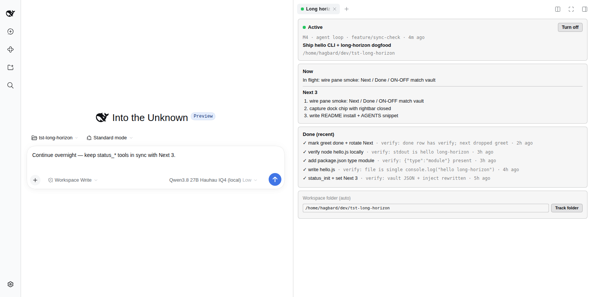
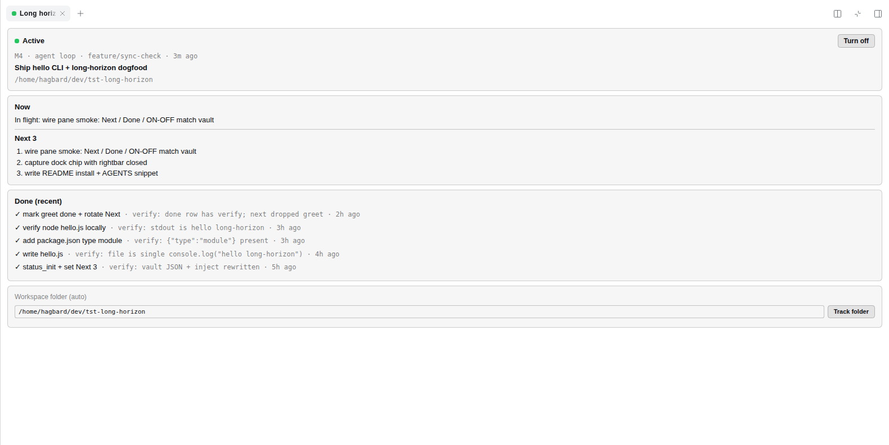
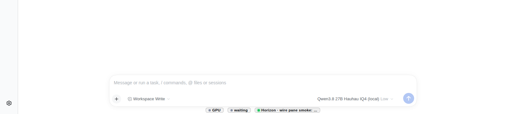

# dsh-local-long-horizon

Host-owned **long-horizon task status** for local coding agents in the
**DeepSeek Harness** web UI.

Soft “keep a STATUS.md” conventions drift: agents invent sections, forget to
update, or burn tokens re-reading files after compaction. This plugin turns that
into a **structured vault** the Host owns, with **validated agent tools**, a
**tiny inject file** for resume, a **one-way `STATUS.md` projection**, and a
**Long horizon** rightbar + composer dock chip for the human.

**Related plugins** (same dual-face `dsh.bundle` shape for the web rightbar / dock):

| Plugin | Repo |
| --- | --- |
| NVIDIA GPU util / VRAM / power | [`dsh-gpu-monitor-nvml`](https://github.com/janpauldahlke/dsh-gpu-monitor-nvml) |
| Local LLM endpoint / slot health | [`dsh-slot-health`](https://github.com/janpauldahlke/dsh-slot-health) |
| Agent process monitor | [`dsh-agent-processes`](https://github.com/janpauldahlke/dsh-agent-processes) |

This package: [`dsh-local-long-horizon`](https://github.com/janpauldahlke/dsh-local-long-horizon).

Verified against DeepSeek Harness **`0.1.7-rc.2`** (`dsh web`).

---

## Requirements

- DeepSeek Harness web profile (`dsh web`).
- Node.js **≥ 20** to build.
- A project **`AGENTS.md`** is **strongly recommended**. DeepSeek Harness
  injects it into agent instructions; this plugin hooks that seam so the agent
  keeps reading the live inject file (snippet below).

---

## Screenshots

Light theme, matching the DSH default.

| Pane + chat (mid-run) | Board (fullscreen) |
| --- | --- |
|  |  |

| Dock chip (rightbar closed, chat active) |
| --- |
|  |

If images fail to load, the ASCII mock below still conveys the layout.

## What you see

```
Long horizon                    ● Active          [ Turn off ]
  M4 · agent loop · main · 20s ago
  Ship hello CLI + long-horizon dogfood
  /home/you/dev/my-project

┌─ Now ─────────────────────────────────────────┐
│  In flight: wire pane smoke: Next / Done …    │
│  Next 3                                       │
│    1. wire pane smoke: Next / Done …          │
│    2. capture dock chip with rightbar closed  │
│    3. write README install + AGENTS snippet   │
├─ Done (recent) ───────────────────────────────┤
│  ✓ verify node hello.js · verify: … · 3h ago  │
│  ✓ write hello.js · verify: … · 4h ago        │
└───────────────────────────────────────────────┘
```

- **ON / OFF per project** — when OFF, mutating tools refuse; the inject file
  freezes to a one-line `DISABLED` notice; `status_get` still works.
- **Next hard-capped at 3** — fourth item is rejected with a clear validation
  error.
- **In flight is one slice** — set with `status_set_inflight`; clear with
  `status_clear_inflight` (empty summary is refused).
- **Done records prefer verify** — missing verify **warns** in v0 (not a hard
  reject).
- **Sync hints** (pane only, not the dock chip) — stale board, git branch
  change, or different chat than the last writer.
- **Dock chip** — short live label under the composer when the rightbar is
  closed (`Horizon · …`, `Horizon · blocked`, …). Click to reopen the pane.

---

## How resume works

DeepSeek Harness already discovers project-root **`AGENTS.md`** (and related
baselines) and **injects them into the agent’s instructions**. This plugin does
not replace that seam — it **hooks into it**.

```
  DSH injects AGENTS.md  ──►  agent instructions every turn
         │
         │  (your AGENTS.md says: read the inject file / use status_* tools)
         ▼
  Agent tools ──► Host TaskStatus service ──► JSON vault (~/.dsh/storages/…)
                         │
                         ├──► <cwd>/STATUS.md                 (human + git)
                         └──► <cwd>/.dsh/task-status-inject.md   (≤ ~50 tokens)
```

1. **Vault is source of truth** — markdown is generated; tools never “only edit
   STATUS.md.”
2. On every successful mutation the Host rewrites the inject file and
   `STATUS.md`.
3. **Recommended:** keep a short root **`AGENTS.md`** so the harness keeps
   pushing the contract into context. That file should tell the agent to treat
   `.dsh/task-status-inject.md` as binding current state (and to update via
   `status_*` tools). The mutable bytes stay in the tiny inject file — not in a
   giant static prompt — while `AGENTS.md` is the stable “glue” DSH already
   knows how to inject.

When you turn Long horizon **ON** (`status_init`, pane “Start tracking”, or
re-enable), the Host **auto-ensures** that glue: creates a minimal root
`AGENTS.md` if missing, or **appends** the `## Long horizon` section if the file
exists without it. It never overwrites a richer human `AGENTS.md` — hand-tune
project-specific rules freely; only the missing section is added.

Without that section, the vault and tools still work, but a fresh agent is more
likely to ignore the inject file and fall back to chat memory or read-loops.

### Recommended `AGENTS.md` snippet

```markdown
## Long horizon
Before coding, read `.dsh/task-status-inject.md` if present — it is binding
current task state (DeepSeek Harness injects this AGENTS.md; the inject file is
the live board).
Use status_* tools to update Next (≤3), in-flight, done (with verify), and blocked.
Do not invent a parallel STATUS novel; the vault owns truth and STATUS.md is generated.
```

---

## Install

### From npm (recommended)

```sh
dsh plugin --profile web add dsh-local-long-horizon
# restart dsh web (or rely on live patch reload), then hard-refresh the browser
```

### From GitHub

```sh
dsh plugin --profile web add github:janpauldahlke/dsh-local-long-horizon
```

### From a git checkout (developers)

```sh
git clone https://github.com/janpauldahlke/dsh-local-long-horizon.git
cd dsh-local-long-horizon
npm install && npm run build
dsh plugin --profile web add "$(pwd)"
```

Restart (or boot) `dsh web` so the host + client faces load:

```sh
env -u DSH_WEB_URL -u DSH_SHELL -u DSH_SESSION_ID dsh web --no-open
```

Uninstall:

```sh
dsh plugin --profile web remove dsh-local-long-horizon
# restart the web instance that had the plugin
```

No harness `file:` dependencies — the host registers tools on the live
`ctx.tools` service provided by dsh.

---

## Agent tools

| Tool | Purpose |
| --- | --- |
| `status_init` | Create / refresh vault for a cwd; turns Long horizon **ON** |
| `status_get` | Full structured record |
| `status_set_next` | Replace Next (0–3 strings) |
| `status_set_inflight` | Set in-flight (**non-empty** `summary` required) |
| `status_clear_inflight` | Clear in-flight |
| `status_set_phase` | Short phase label |
| `status_mark_done` | Append done (+ optional `verify`, `rotateNext`) |
| `status_block` / `status_unblock` | Blocked reason |
| `status_set_enabled` | ON / OFF |
| `status_ping` | Host health probe |

Default cwd comes from the agent session workspace; pass `cwd` to override.

---

## Surfaces

| Surface | Path / name |
| --- | --- |
| Vault | `~/.dsh/storages/dsh-local-long-horizon/<taskId>.json` |
| Inject | `<cwd>/.dsh/task-status-inject.md` |
| Markdown | `<cwd>/STATUS.md` (**overwritten** on every mutation) |
| HTTP | `GET` / `POST` `/api/dsh-local-long-horizon` |
| UI | Rightbar **Long horizon** + composer dock chip |

The pane **auto-follows the chat’s workspace folder**. Use **Track folder** only
to override; **Use chat workspace** resets.

---

## Architecture

Dual-face package (same bar as gpu-monitor / slot-health):

- **Host** (`lib/index.js`, ESM) — vault service, agent tools, HTTP route.
- **Client** (`lib/client.js`, CJS ModuleLoader factory) — rightbar pane + dock
  chip; polls the Host JSON route.
- **Glue** — `cordis.patch.yml` + `dsh.bundle` / `dsh.client` in `package.json`.

Presentation is **inline styles only** (sibling chrome: `currentColor`, rounded
cards, muted mono ages).

```
dsh-local-long-horizon/
├── package.json
├── build.mjs
├── cordis.patch.yml
├── media/                 # README screenshots
├── src/host/              # vault, tools, route, inject, STATUS.md
├── src/client/            # pane + dock chip
├── src/shared/            # shared types
└── lib/                   # built artifacts (required at runtime)
```

---

## Develop / test

```sh
npm test          # build + node suite (schema, vault, tools — no GPU)
```

---

## Limitations

- **Last-writer-wins** — no distributed lock across sessions.
- **Next ≤ 3** is intentional; keep overnight plans rotating, not novel-length.
- Chats without a workspace cwd need a folder open (or a pasted absolute path).
- Out of tree only — no DeepSeek Harness core patches.
- `STATUS.md` overwrite is one-way: treat hand-edits as disposable.

---

## Contributing

See [CONTRIBUTING.md](./CONTRIBUTING.md) for setup, layout, and PR expectations.

## License

MIT — see [LICENSE](./LICENSE).
